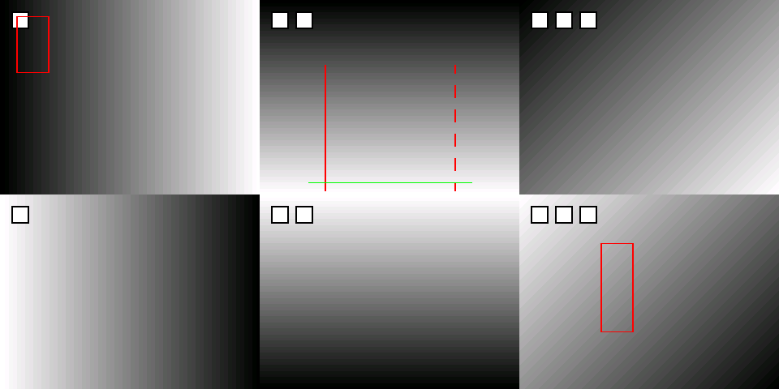

# 六路感知显示与车辆控制联调说明

2026-10-10，partC 工作区。主前视固定为 **M 板 cmos5，即六宫格上排中间**。本次新增完整运行入口 `scripts/start_adas.sh`，把采集、推理、标注、UDP 和 FSPI 执行接在同一套协议上。旧灰度演示和 J8 双目测试入口保留。

当前交付是可以进入硬件联调的代码和离线测试，**尚不能称为论文全部复现、上板必然识别成功**。PDS 综合/布局布线、真实 RKNN 推理、摄像头方向和电机电气动作均未在实板验证。六路夜视已接入增益/暗部曲线 ISP；论文 CNN 的等效复现、模型导出的 anchor grid 核对仍有缺口，见最后一节。

## 1 当前数据通路

每块板：三路 OV5640 → 三个独立 ISP → DDR 拼接 → PCIe → RK3568。每路原始采集为 640×480，经现有 DDR 拼接逻辑降采样到 320×240。单板传输仍是 640×480，第四象限丢弃。

| 屏幕位置 | FPGA 输入 | 算法用途 |
|---|---|---|
| 上排左 | M cmos2 | YOLOv5 行人 |
| **上排中** | **M cmos5** | **YOLOv5 行人、YOLOPv2、红绿灯、虚实线、斑马线** |
| 上排右 | M cmos6 | YOLOv5 行人 |
| 下排左、中、右 | S cmos2、cmos5、cmos6 | 分别运行 YOLOv5 行人 |

M 将本板原图和检测元数据一起通过 UDP 发给 S。S 合成本板三路和 M 三路，输出 960×480 的两行三列。检测在原始子图上运行，叠加结果不再进入下一轮推理。

完整工程的 J8 CAM1 是 cmos5、CAM2 是 cmos6；cmos2 走原工程对应的扩展接口。**这与此前 stereo_j8 测试把两只眼睛映射到左、右格不同**。将用于主前视的镜头安装到 cmos5 对应位置，不能沿用旧测试的格子位置判断接线。

## 2 本次补齐和修正

| 项目 | 本次实现 | 仍须验证的内容 |
|---|---|---|
| YOLOv5 行人 | 查询真实张量尺寸；RGB letterbox；三个检测头解码；置信度筛选、NMS、坐标还原；M/S 各三路；红色框 | 实际检出率、距离、光照、RKNN 运行时兼容性 |
| YOLOPv2 | 两个分割头和三个检测头均被消费；车道/可行驶区域还原到 M 主前视；多任务检测框为蓝色 | 导出模型的 anchors 与类别含义核对；蓝框不作为行人急停依据 |
| 虚实线标注 | 左右线类型来自分割结果分析；实线红色连续线，虚线红色分段线；未知类型不伪装成已识别 | 摄像头俯仰角、车道宽度、断空率及转向阈值现场标定 |
| 斑马线 | 检测和绿色条纹标注共用自适应灰度阈值；结果进入短时松开驱动策略 | 斑马线尺寸、阴影、路面纹理产生的误检 |
| 红绿灯 | M 主前视的颜色/连通域算法接入；灯区框与全屏灯色提示；终端输出 RED/GREEN/YELLOW/UNKNOWN | 当前是颜色规则，不是专门训练的交通灯网络；需现场排除其他红绿物体 |
| 串口屏 | 新解析器单过程写寄存器、超时复位、合法值检查；0x0F 选择六宫格/六个单视图；通过 FSPI 读回进入 X11 显示 | 控件事件需要按新字节表修改；没有给屏回传检测文字的 TXD 通路 |
| 六路夜视 | 每板三路独立处理，参数跨时钟同步、帧边界更新；增益或暗部曲线、亮度、饱和度、黑电平等连接到实际像素 | **不是论文 CNN 的等效实现**；增强质量、资源和时序待验证 |
| 并行处理 | 采集线程、推理线程、网络/显示/决策主循环分开；只保留最新帧；推理间隔可选 1/3/5 | 默认每板视频采集 10 fps，不是六路推理均 10 fps；日志报告实际推理耗时 |
| UDP | 同帧携带图像、框、车道点、灯色、斑马线与结果年龄；固定结构尺寸检查；严格检查最后一块长度 | 实网丢包、吞吐和排队延迟；本次没有实板联网测试 |
| 控制 | M/S 行人均停车；红/黄灯锁停；斑马线 COAST；实线压线停车；转向改为非阻塞；所有动作显式设置输出 | 开环转向时间仍需按车模标定，初始车轮必须回中 |
| 故障保护 | 命令时戳和校验；过期停车；FSPI 错误停车；FPGA 心跳看门狗；摄像头完整帧活性检查 | 电机接口的低有效/保持停车语义、实际制动效果 |

框按**推理结果的更新频率**移动，不包含目标身份跟踪或帧间运动预测。视频可继续刷新，框可能落后若干帧；日志中的 `analysis`、`frame` 和 `age` 用于测量这一差异。

另修复了车道几何计算的分辨率错误：原先固定 30 行一带，在实际 320×240 子图上只能算到五个带，却除以八计算置信度。现在 ROI 等分为八带，转弯和压线阈值按图宽缩放；标注与虚实线分析共用概率阈值。

## 3 控制规则和超时

最高优先级是故障或行人停车，然后是红/黄灯停车、实线压线、斑马线松开驱动，最后才根据主前视车道结果前进/转向。

- 任一板检测到行人立即置停车状态；推理线程发现行人后先发布危险标志，不等待其他摄像头和多任务推理结束。恢复需要 M、S **各三轮不同的完整分析结果**都没有行人，重复旧帧不能解除停车。
- 红/黄灯停车后，灯暂时消失仍停车；三个不同分析帧连续为高置信绿灯才解除锁定。没有检测到过红灯的普通无灯路段可根据车道结果行驶。
- 新进入斑马线区域时，400 ms 内松开前进和后退驱动；保持车轮当前位置，不触发急刹。更高优先级危险会覆盖 COAST。
- 图像断流超过 500 ms、分析结果年龄超过 2500 ms、模型失败、摄像头不完整或车道不可靠，均输出 STOP。**2500 ms 是拒绝旧结果的上限，不是可接受的自动驾驶反应时间。**需根据实际速度和推理延迟进一步收紧。
- 决策命令发布周期 20 ms；控制器拒绝超过 250 ms 的命令或校验不一致的共享内存快照。
- FPGA 在 500 ms 没收到心跳，或本板任意摄像头 500 ms 没有完整帧后，关断运动并保持 STOP。心跳恢复不自动恢复此前运动寄存器。
- 新运行入口默认 PREVIEW，所有电机输出停车。只有 S 端显式 `--drive` 才消费有效自动决策。键盘空格锁停，A 解除键盘锁停；A 不会绕过行人、红灯和故障条件。

控制器启动会先清除上一次运行的命令。退出和 FSPI 错误时先写 STOP，再关断其他方向。FPGA 看门狗提供进程被强制结束后的独立停车路径。

## 4 PDS 工程和烧录

本次使用 **`fpga/fpga_pcie_ov5640/drive_6ch`**。旧 `source/image_pcie_capture.v` 和 `stereo_j8` 顶层不包含本次完整控制协议，不能与新自动控制程序混用。M/S 使用同一完整位流，角色由 Linux 参数区分。

1. 在支持目标器件的完整版 PDS 中新建空 RTL 工程，器件为 Logos2 / PG2L100H / FBG484 / -6，顶层 `image_pcie_capture`。不能用 PGL50H 代替。
2. 整体复制仓库，至少保留 `drive_6ch`、`stereo_j8`、`source`、`project/ipcore` 四个目录的相对关系。
3. 在 PDS Tcl Console 执行 `source {队友电脑上的仓库路径/fpga/fpga_pcie_ov5640/drive_6ch/add_sources.tcl}`。只修改这一处外部路径。脚本会先检查文件和器件，再导入 39 个设计项和一个 FDC。
4. 不要再 Add 整个旧 `source` 或 `stereo_j8` 目录，防止重复顶层/模块。`tb_drive.sv` 是仿真测试文件，不加入综合工程。
5. 检查工程器件、全部 IP 的目标系列、生成时钟及引脚。完成综合、映射、布局布线和时序分析后生成 bitstream。检查所有未约束路径、CDC、锁存器、重复驱动和资源溢出报告。
6. 先通过 JTAG 扫描确认 PG2L100H，再下载本次生成的位流到 SRAM 做调试。下载改变 FPGA 配置后按 PCIe 驱动要求重新枚举/重启 RK3568；不要把驱动加载失败当摄像头问题。SRAM 配置掉电丢失。
7. SRAM 联调验收通过后，再按官方板卡烧录流程生成并写入 Flash 启动文件。本次没有生成或宣称验证过 `.bit`/Flash 镜像。

原 IP 来自 PDS 2022.2-SP6.4 工程，需在可用完整版中检查兼容性。本机 Vivado 只用于通用 RTL 仿真，**不能代替紫光同创 PDS 综合**。

### 关键引脚

三路摄像头封装球位继续使用此前核查表，见 `docs/partC-paper-reproduction-audit.md` 第 5 节；J8 连接器与手册页对照见 `docs/partC-stereo-j8-guide.md`。新 FDC 由原约束与已修正的双目约束生成，未猜测新的 TXD/XCLK 球位。

| 信号 | FPGA 球位 |
|---|---|
| UART RXD | C22 |
| FSPI CLK / CS | L19 / L20 |
| FSPI D0 / D1 / D2 / D3 | N22 / M22 / M18 / L18 |
| 前进 / 后退 | G17 / J14 |
| 左转 / 右转 / 停车 | F15 / E22 / H13 |

这是 FPGA 球位表，不是排针编号。I/O 电压以新 FDC 和实际底板原理图为准；串口屏接收使用 free_clk 25 MHz 分频得到 115200 波特率，不再依赖旧 UART 专用 PLL。

## 5 串口屏事件与参数

屏发送 **四个原始字节** `30 90 selector value`，115200、8 数据位、无校验、1 停止位。不要把十六进制字符当 ASCII 文本发送。四字节间停顿不能超过 10 ms。

| 操作 | 原始十六进制字节 |
|---|---|
| 六宫格 | `30 90 0F 00` |
| M 左 / M 主前视 / M 右 | `30 90 0F 01` / `30 90 0F 02` / `30 90 0F 03` |
| S 左 / S 中 / S 右 | `30 90 0F 04` / `30 90 0F 05` / `30 90 0F 06` |
| 正常图像 / 夜视 / 旁路 | `30 90 01 01` / `30 90 01 02` / `30 90 01 00` |
| 夜视等级 4 | `30 90 04 04` |
| 使用暗部曲线 | `30 90 0A 01` |

将视角按钮事件改为上述 0x0F 命令。0x04 专门调整增强等级，**不再兼作镜头选择或直接操纵电机**。新固件不会把旧 0xA～0xD 值解释为运动命令。

| selector | 范围与默认值 | 新 ISP 中的实际作用 |
|---|---|---|
| 01 | 0～3，默认 1 | 旁路、正常、夜视、调试；旧 8～16 兼容映射到夜视等级 0～8 |
| 02 | 0～255，默认 0 | 黑电平扣除 |
| 03 | 0～255，默认 128 | 手动红蓝平衡增益，中值为中性 |
| 04 | 0～8，默认 2 | 增强强度；字段名 cnn_level 为历史兼容名 |
| 05 / 06 | 0～255，默认 128 | 饱和度 / 亮度 |
| 07 | 0/1，默认 0 | 启用手动白平衡增益；没有伪称实现自动白平衡估计 |
| 08 / 09 | 默认 128 / 64 | 调试二值阈值 / 水平亮度差阈值；不是完整 3×3 Sobel |
| 0A | 0/1，默认 1 | 线性增益 / 暗部曲线 |
| 0B～0E | 默认 16/240/16/240 | 调试模式 Cb/Cr 上下限 |
| 0F | 0～6，默认 0 | 显示选择 |

ISP 参数作用于**接收该串口命令的板卡**的三路相机。S 的视角选择可选择全部六路画面。没有实现 S 屏向 M 下发 ISP 参数的网络遥控；要同时设置两板夜视，需要分别配置两板。

UART 顶层只有 RXD，屏向 FPGA 的交互已经接通，但“在串口屏上显示检测文字/回读确认”缺少已核定的 TXD 接线，不能宣称完成。当前检测结果显示在 HDMI/X11 和终端。

## 6 板端启动

两板更新相同源码。需有匹配内核的 PCIe 驱动、RKNN 运行库、GCC、make、X11 开发库。`lib/librknnrt.so`、两个 `model/*.rknn` 均须保留。新入口每次重新编译当前源文件，失败即停止，不回退到旧 `bin/` 程序。

先停止旧进程；确认 FPGA 已加载新位流、PCIe 与 FSPI 设备节点存在。网络沿用 M=192.168.100.10/24、S=192.168.100.20/24、UDP 8888。已配置的网络无需重复配置；需要时分别执行原 `setup_network_m.sh` / `setup_network_s.sh`，通过 NET_IF 指定直连端口。

新入口不自动改变系统网络参数。两板每次重启后、启动前运行 `sudo env IFACE=实际直连网口 bash scripts/tune_net.sh`，提高 UDP 缓冲；没有使用持久化参数时，重启会恢复内核默认值。S 启动会打印实际 `SO_RCVBUF`；缓冲被截断时可能整帧一直重组不成功。

在 S 板图形桌面的终端：

```bash
cd /实际的仓库目录
bash scripts/stop_all.sh
sudo --preserve-env=DISPLAY,XAUTHORITY bash scripts/start_s.sh --adas
```

在 M 板：

```bash
cd /实际的仓库目录
bash scripts/stop_all.sh
sudo bash scripts/start_m.sh --adas --interval 1 --fps 10
```

也可直接使用 `bash scripts/start_adas.sh m|s`。**不要同时启动旧 perception_main/udp_m_send_main/planning_main**，否则争用 PCIe 或 UDP。新进程使用互斥文件锁；脚本额外检查旧进程。

预览成功时，应看到 M 三路在上、S 三路在下；只有 M 中间格出现道路标注。`[VISION]` 打印每轮分析的行人位图、灯色和推理耗时，`[ADAS]` 打印本地/远端帧号与结果年龄。`logs/adas-s-control.log` 或 M 对应日志记录 FSPI 启动错误。

预览也计算真实策略，`[POLICY] decision=... command=...` 在决策变化时立即输出。1=前进、3/4=左/右、6=停车、7=松开驱动。预览时 `decision` 可变化，**实际 `command` 始终为 6**；因此可先检查识别→决策变化，再启用运动。显示中的蓝色横条表示 COAST，断流后灯色提示回到未知。

两板三路均完整、模型有效后 `healthy` 才为 1。缺摄像头不允许驱动；只接双目测试应继续使用原 `--stereo-pcie` 视频入口。新驱动看到非 A6 版本时会拒绝运动，提示加载 `drive_6ch`。

先架空驱动轮，用原始 GPIO 电平/示波器核实前后左右和 STOP，检查车轮回中、转向行程及制动保持行为。完成下节的故障测试后，在 S 板停止预览并启动：

```bash
sudo --preserve-env=DISPLAY,XAUTHORITY bash scripts/start_s.sh --adas --drive
```

M 端继续运行原来的新入口。Ctrl-C 停止两个进程，或双板执行 `bash scripts/stop_all.sh`。

### 与电脑或板卡环境有关的设置

| 设置 | 修改方法 |
|---|---|
| PDS 工程导入路径 | 改 Tcl Console 的 `source {...}` 中仓库路径，保留目录相对位置 |
| 板端仓库路径 | 启动前 `cd` 到实际目录；脚本自行解析位置 |
| S 的 IP | M 启动时传 `--ip 实际S地址`，或 `sudo env S_IP=实际地址 bash scripts/start_m.sh --adas` |
| 摄像头 PCIe 节点 | `PCIE_DEVICE=/实际设备节点`；节点必须是兼容 Pango DMA ioctl 的驱动，不能填 `/dev/video0` |
| FSPI 节点 | `FSPI_DEVICE=/实际spidev节点` |
| FSPI 速率 | `FSPI_SPEED_HZ=1000000`，可降到 100000；驱动拒绝高于 1 MHz，与当前采样设计一致 |
| 模型位置 | `--person-model /路径/模型.rknn`、M 的 `--lane-model /路径/模型.rknn` |
| 导出模型 anchors | `YOLO5_ANCHORS=/路径/18个数.txt` / `YOLOP_ANCHORS=/路径/18个数.txt`；顺序为 stride 8、16、32，各三组宽高 |
| 图形会话 | 从 S 桌面终端启动，保留 DISPLAY/XAUTHORITY；SSH 下可用 `--no-lcd` 验证日志与通信 |
| 离线测试编译器 | `test_adas.py --cc gcc路径`；`--zig` 为可选交叉编译器路径 |
| RTL 仿真工具 | `test_drive_rtl.ps1 -VivadoBin 队友电脑的Vivado/bin`；PDS 工程本身不依赖这个脚本 |

这些环境变量用 sudo 时应通过 `sudo env 变量=值 ...` 显式传递。PDS 器件型号、封装球位、协议版本和模型输出语义不能因为电脑不同而改成“近似值”。

## 7 本机已经验证的内容

本次执行了原 common/perception/planning/control 全量重编译及单元测试；新增闭环与模型适配测试；33 个生产 C 源文件的 AArch64 Linux 对象编译；新增 RTL 行为仿真；完整工程清单和引脚一致性检查。

| 检查 | 结果和限制 |
|---|---|
| 原有单元测试全量重编译 | 通过 |
| 新闭环测试 | 行人 M/S 优先级、锁定恢复、红/绿灯、实虚线差异、斑马线、断流、旧结果、命令破损/超时、急停打断转向通过 |
| YOLO 与 RKNN 适配测试 | 合成概率/logits、NCHW/NHWC、NMS、坐标还原、分割缩放、错误张量拒绝、输出释放通过；**不代表真实 NPU 准确率** |
| UDP 新帧 | 616224 字节完整帧逆序重组、最后块过长/过短拒绝、元数据保留通过 |
| 画面 | 六宫格、红框、红实线、红虚线、绿斑马线和单路视角通过像素检查 |
| ARM Linux 分支 | 33 个生产文件通过 `-Wall -Wextra -Werror` 对象编译；控制程序成功链接为 AArch64 Linux ELF。Linux 系统头文件真实，感知/显示部分 X11 仅声明桩，**未验证完整感知程序板端链接、RKNN 加载和执行** |
| 启停脚本 | 四个脚本逐个通过 Bash 语法检查；未在本机执行板端启停 |
| RTL 仿真 | UART 错帧/超时/范围、三个不同像素时钟的增强/旁路、相机停帧、FSPI 读写与方向切换、上电停车、心跳超时、禁止恢复旧动作通过 |
| 工程完整性 | 39 个设计文件存在，110 个球位无重复；三路增强接入检查通过；用户 RTL 展开通过，厂商 IP/原语仍需 PDS 处理 |

复跑方式：

```bash
python3 scripts/test_adas.py --cc gcc
python3 scripts/audit_rknn_models.py
python3 scripts/check_drive_sources.py
```

Windows 的 RTL 仿真：

```powershell
powershell -File scripts/test_drive_rtl.ps1 -VivadoBin C:\Xilinx\Vivado\2018.3\bin
```

测试输出在 `tmp/adas_tests/results.log`、`tmp/adas_sim/drive-result.log`；合成标注预览为 `tmp/adas-overlay-preview.ppm`。预览图的框和道路结果是测试输入，不能当作模型已经识别了真实场景。



## 8 上板验收顺序

1. **构建与协议**：PDS 无综合错误、资源不溢出、约束与时序满足；两个板的 FSPI 版本都读到 A6。确认每板 camera mask=7。
2. **原图与位置**：依次遮挡六个镜头，核实只改变对应格；M cmos5 必须朝正前方。检测框不能跨到别的格。
3. **行人**：在每个镜头前移动行人目标，观察红框位置、检测年龄和 STOP；多个行人同时出现时都应标注。离开后旧帧不能自行计数解除停车。
4. **交通灯**：M 主前视先红再绿；红灯 STOP，遮住红灯仍保持；连续三个新绿灯分析结果才恢复。记录不同距离和曝光下的误检。
5. **道路**：分别使用实线、虚线、斑马线实物；确认实线红连续、虚线红分段、斑马线绿色；压实线停车；新进入斑马线前进 GPIO 短时释放。
6. **夜视与屏幕**：分别给 M/S 开启夜视，对比三路均发生改变；S 屏逐个切换六路视角再回六宫格。切视角不能改变主前视算法来源。
7. **故障**：转向时引入行人；拔掉 M 网线；停止任一 NPU/采集进程；停掉 control_main；断开任意摄像头。确认运动输出撤销，FPGA STOP 保持。重新连接后确认不会复活旧命令。
8. **性能**：记录采集 fps、每轮三个 YOLOv5 加 YOLOPv2 的耗时、结果年龄、UDP 丢帧和最终制动时间。调 `--interval 1/3/5` 与 `--fps` 后重新测量，不能以显示刷新率替代推理帧率。

## 9 尚未完成和不能保证的部分

- **论文 CNN 六路等效增强**：本次完成六路可调 ISP 增强通路，未证明与原 CNN 网络等效。原 CNN 的训练/权重效果、逐像素时序及三实例资源预算需要单独验收；不能把本次曲线增强记为该论文指标达标。
- **模型 anchors**：你们已确认暂时只有仓库 RKNN，没有原 PT/ONNX/转换脚本。两个现有 RKNN 仅提供检测原始头，缺少导出时的 anchor grid。代码用标准 YOLOv5 和 YOLOv7/YOLOPv2 参考参数，并支持覆盖；当前不能凭现有输出形状独立证明 anchors 正确。上板需检查已知目标框的位置/尺寸；以后取得原导出参数再核对和覆盖。
- **实景准确率与电机闭环反馈**：本次没有真实画面推理样本、里程计/转向传感器反馈，转向仍是按原车模时长估计。不能保证一下载就无需阈值或机械标定。
- **串口屏结果回传**：没有核定 TXD 端口；仅完成屏→FPGA 参数和视角交互，以及 FPGA→RK3568→HDMI 的显示反馈。
- **导航视频理解、U 盘图片/视频场景播放器**：属于截图中的赛题附加项，本次摄像头闭环入口未实现，不应列为已完成。
- **PDS 位流、帧率/时延指标、Flash 固化**：均须使用完整版工具和两块实板完成，现有离线测试不能代替。

RKNN 元数据和文件 SHA256 已保存到 `docs/adas-model-profiles.json`，可用审计脚本从模型本体重新提取。解码和后处理语义参考 [Rockchip YOLOv5 后处理](https://github.com/airockchip/rknn_model_zoo/blob/main/examples/yolov5/cpp/postprocess.cc) 与 [YOLOPv2 官方推理工具](https://github.com/CAIC-AD/YOLOPv2/blob/main/utils/utils.py)；这些源码支持解码公式，不证明仓库二进制模型采用相同 anchors。

## 10 主要修改文件

`planning/csrc/adas_main.c`、`perception/csrc/vision_worker.c` 负责新主路径；`rknn_vision.c` / `yolo_decode.c` 负责模型适配；`vision_frame.c` 负责裁图/标注/结果协议；`drive_policy.c` 负责优先级与锁定；`actuator.c` / `main_control.c` / `fspi_driver.c` 负责执行与保护。

新增 `drive_6ch` 工程与生成/检查/仿真脚本；更新三个模块 Makefile、UDP 收发与重组、显示合成、ISP 字典、启动/停止脚本。原 paper audit 是上次核查的历史记录，本说明给出新入口的当前状态。旧 `planning_main` / `decision.c` 是兼容演示路径，不能据此宣称新闭环已启动；旧命令缺少时戳/校验，会被新控制器拒绝。

本次代码写入 D 盘 partC 工作区，E 盘参考工程未修改；未提交、未推送，也未下载位流到板卡。

便于交给队友，工作区更新已整理为 `_transfer/partC-adas-update-20261010.zip`：包含当前相对 `e165d0f` 的修改文件（也包含前一次尚未提交的 PDS 路径兼容修正）、SHA256 清单和测试日志。它是供现有 partC 仓库使用的增量源码包，**不含原厂 IP、模型、运行库和可烧录位流**。先备份/比较队友本地改动，再把包内 `files/` 内容按相对路径合入仓库；不要直接在压缩包中创建 PDS 工程。仅执行板卡 `git pull` 不会得到本机未提交的修改。
