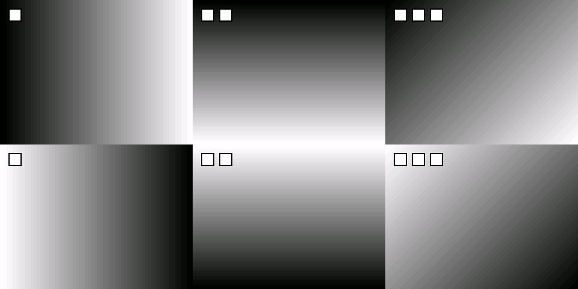

# partC 小车复现核查与六路显示验证

核查日期：2026-10-09。基线：partC / `65811be`。本次修改位于 `D:\vmshare\image_recognition`，`E:\image_recognition` 仅作为参考，未修改。未连接两块实板、未烧写 FPGA、未运行车辆执行器。

## 1. 已确认的系统定义

一块“板卡”包含 **PG2L100H-6IFBG484 FPGA + RK3568J**，不是把 FPGA 和 ARM 分别叫 M/S。两块板卡各接三路 OV5640，合计六路。板卡型号依据用户提供的 2026 选题指南 PDF 第 3 页（正文第 1 页）。

本项目继续采用：M 板卡负责车道感知和 UDP 发送；S 板卡负责 UDP 接收、本地摄像头、行人检测、合成显示及控制输出。论文 §2.4.2 的模型部署 M/S 称谓与此相反；这里以用户明确的板卡命名和现有部署为准，不交换程序。

论文《FPGA-Based Front-End Low-Light Enhancement for Deterministic Vision-Only Driving Perception》（Electronics 2026, 15, 1224）第 3、6、15 页描述的显示是：每板三路降采样到 320×240，装入一个 640×480 四宫格，两板组合为 1280×480。用户要求的 **960×480、2 行 3 列** 是对显示布局的明确调整，底层采集/UDP 的 640×480 RGB565 帧格式继续沿用。

```text
M板 OV5640×3 → M FPGA → PCIe → M RK3568J → UDP → S RK3568J ┐
S板 OV5640×3 → S FPGA → PCIe → S RK3568J -------------------┤
                                                         ↓
                        M cmos2 | M cmos5 | M cmos6
                        S cmos2 | S cmos5 | S cmos6
                         320×240 的格子，整体 960×480
```

这里的“拼接”是六幅图的平铺展示；没有做标定、畸变校正、透视变换或无缝鸟瞰融合。论文描述的该显示部分同样是网格拼接，不能把它等同于几何环视融合。

## 2. 为什么照片还是八宫格

核查开始时，HEAD 已有 `31668d0` 和 `b13936c` 的六宫格代码。`driving_config.h` 的窗口已为 960×480，`render_lcd_x11.c` 也已裁出每板前三格。因此本次不是第一次添加六宫格。

照片中的“左右两个四宫格、棋盘填空、彩色箭头”与旧版输出特征相符。没有读取板上运行文件，不能仅凭照片确定是哪一个部署环节出错。但原脚本确实存在这些路径：

- 先选择 `bin/planning_main`，再选择刚由 `make -C planning bin` 生成的 `planning/planning_main`；时间戳可能使旧部署产物仍被判为新鲜。
- 自动重编译失败后仍回退旧程序；已经在运行的旧窗口也不会因重新编译而更新。
- 用 `ipcs` 中有无共享段推断“有采集进程”，但 System V 段可以在写者退出后继续存在。
- `--local-stub` 原先仍优先读共享内存，旧帧/零帧可以覆盖预先生成的 S 端图案。
- 默认彩色叠加层与用户要求的纯灰度验证图不同。

以上软件路径已处理。两板更新源码并重新编译后，应通过实际启动路径、版本标识和窗口标题共同确认运行的是新程序。

## 3. 本次具体修改

| 文件 | 修改及作用 |
|---|---|
| `planning/csrc/frame_compose.c`、`include/frame_compose.h`（新增） | 抽出真实 X11 使用的六路合成函数。上排 M、下排 S；每板只取左上/右上/左下，丢弃右下；检查输出尺寸和容量；输出 BGRX，缺失来源填黑。 |
| `planning/csrc/render_lcd_x11.c` | 调用上述合成函数；窗口标题增加 `6CH: M top / S bottom`；只有调用叠加接口才绘制彩色层；拒绝不匹配的画布尺寸，避免裁剪写越界。 |
| `planning/csrc/main_planning.c` | 新增 `--local-pcie`，直接复用 `pcie_capture` 从 S 自己的 FPGA 抓取帧；保留外部 shm 模式；`--local-stub` 强制使用模拟图，绝不读残留图像段。 |
| 同上 | 新增 `--no-person`、`--no-overlay`、`--build-info`；模拟图不跑行人推理，模拟显示模式发布 STOP 而不是用合成直道结果发布 GO，并关闭该模式下的驾驶键盘覆盖。 |
| 同上 | 完整 UDP 帧收到时立即快照，避免同一轮继续收下一帧时重组缓冲覆盖已完成的图；只接受 640×480 RGB565 完整帧。 |
| 同上 | 显示按最高 10Hz 刷新，M 暂无新帧时 S 本地图仍能刷新。该限制是当前调试策略，不代表论文的 58fps 已复现。 |
| `planning/csrc/udp_m_send_main.c` | 新增版本查询、`--ip`；桩模式不再读取真实/残留的红绿灯、虚实线、斑马线共享段。 |
| `planning/include/build_info.h`（新增） | M/S 程序输出 `ADAS-6CH-v2 layout=960x480 M=top S=bottom` 及编译时间。 |
| `scripts/resolve_bin.sh`（新增） | 先选模块内的板端构建，再选部署目录；检查六路版本；将 Makefile 和 PCIe 依赖纳入新鲜度判断；编译失败不回退旧版。旧二进制先静态检查标识，避免其忽略 `--build-info` 后误启动。 |
| `scripts/start_s.sh` | 默认确定地使用本地模拟图，自动关推理和彩色叠加；显式支持 PCIe/外部 shm；真实 PCIe 失败不伪装成模拟成功；单板自测改发 `127.0.0.1`；打印程序路径和版本。PCIe 模式为桌面运行用户设置设备节点访问权限。 |
| `scripts/start_m.sh`、`start_s.sh` | 共用程序选择逻辑，拒绝重复启动已有主进程；增加帮助信息。 |
| `scripts/stop_all.sh` | 先通知 `control_main` 退出，再停止图像/决策进程；原脚本遗漏了控制进程。此修改不等于修复控制器内部全部停车缺陷。 |
| `planning/Makefile` | 板端 S 程序链接六路合成与 PCIe 采集；加入拼接测试。 |
| `planning/test/test_compose.c`（新增） | 检查六格通道顺序、全部边界、RGB 色序、空来源、画布越界保护，以及乱序 UDP 分块重组后生成实际显示像素。 |
| `scripts/test_resolve_bin.sh`（新增） | 隔离验证脚本语法/帮助、模块产物优先、拒绝旧程序、Makefile 变更触发重建、重建失败不回退。 |
| `docs/preview_6ch_verified.png`（新增） | 由 C 测试调用实际合成函数生成的像素转换为 PNG，仅作本机软件验证证据。 |

未修改 FPGA RTL、引脚约束、HMI 工程或模型权重；未生成新的 FPGA bitstream；未提交或推送 Git。



## 4. 对照论文：仍未完成或未验证的功能

“已有实现”仅代表在主路径中找到相应代码；“待上板”不能写成“已完成复现”。

| 功能与论文依据 | 本次核查后的状态 | 未完成部分 / 证据 |
|---|---|---|
| 每板 3 路 DVP 摄像头，合计 6 路（§2.1、§3.1） | RTL 接口、I²C 配置、采集模块、引脚约束已有；待实测 | 顶层接的是 `cmos2/5/6`，不是六路集中接 S，也不是 Linux 的六个 `/dev/video*`。需要逐路检查 SCCB、PCLK、VSYNC、数据和方向。 |
| FPGA 帧对齐、降采样、DDR 缓存（§2.1） | 已有主要逻辑，待仿真/时序/实板 | `axi4_ctrl_3ch.v` 有异步 FIFO、VSYNC 同步、轮询写、帧计数与多帧地址索引；不能由此证明无丢帧/撕裂，也没有两板全局同步时间基准。 |
| S 板真实采集到显示 | **本次补了直接 PCIe 软件入口** | 原先只有 shm 读者而启动流程没有 S 图像写者。新入口可由 `--local-pcie` 运行，但内核驱动、DMA 对齐、三相机输入和 HDMI 尚未在实板验证。 |
| M 板采集→UDP→S | 代码路径存在；协议/重组本机测试通过 | M 图像发布受 `perception_step()` 的推理成功和车道帧更新约束；没有独立高速视频发布链。模型失败可以同时切断图像发布。 |
| 六路显示 | **软件像素验证通过** | 当前实现符合用户的 2×3 要求；双板网络、X11 真窗口和实际屏幕仍待部署验证。 |
| 三路/六路夜视增强（§2.1、§2.2） | **仅部分接入** | 顶层只将 `video2` 接入 `cnn_top`；`video5/6` 直接进入拼接。不能声称六路均已完成论文描述的独立增强流水线。 |
| RGB/YCbCr、卷积、Gamma、中值滤波（§2.2 式 1–9） | 有颜色转换、卷积/Gamma 源码；完整等价性未验证 | `cnn_top` 活跃实例为颜色转换→卷积→Gamma→RGB 恢复；此主路径未找到论文所述 3×3 中值滤波实例。目录有文件不代表已经接入；权重、定点结果及图像质量还需对照。 |
| UART 触摸屏调参（图 2） | **部分解析，未形成完整交互** | `uart_lcd.v` 解 `30 90 sel data`；顶层只连 `mode` 和 `cnn_level`，亮度/饱和度/AWB 等输出没有落到 ISP；TX 未接外部引脚，无状态回传。 |
| UART 模块本身 | **有明确 RTL 缺陷待修** | 同一组输出寄存器在状态机 always 中写数据，又在另一个 always 中赋复位值，存在多过程驱动。需合并为单一时序所有者并补 UART testbench/PDS 综合。 |
| HMI 与参数字典一致性 | **不一致** | `isp_params.c` 的 mode 为 0–3，而顶层用 8–16 映射增强 level；字典 cnn_level 为 0–4，顶层却把它作为 `select_rearview`，含 A/B/C/D 驾驶选择。ISP 元数据不能当作已实现寄存器块。 |
| 六视角切换（图 2） | **未贯通** | `planning_main` 固定 `DISPLAY_MODE_SPLIT`，没有消费 `shm_display`；当前 enum 只有分屏/本地/远端/黑屏，没有六个单相机视角。控制代码已删除旧屏幕按钮读取逻辑。 |
| FSPI 读回 HMI 选择 | **读协议未闭环** | FPGA 将 0x80 解成读命令；`fspi_driver.c` 读函数仍发送 0x00，且读写阶段片选时序需核对。不能只加一次 read_reg 就宣称屏幕切换完成。 |
| S 端 YOLOv5 行人检测（§2.4.2） | **仍是框架/示意解析，未完成** | 模型文件名为 640×640，但直接提交 640×480 像素；未根据 `rknn_query` 处理输入尺寸、输出张量；只取一个输出，每 6 个 float 当一个候选，缺正式多尺度头解码、anchors/NMS、坐标反算，检测框被写成整幅图。 |
| M 端 YOLOPv2 多任务（§2.4.2、图 6） | 车道/可行驶区张量读取已有，完整多任务未完成 | `lane_detect.c` 明确不使用检测头 2–4；没有论文图中的车辆框输出。可行驶区虽然存入 `drivable`，没有完整消费、可视化或独立发布路径。 |
| 多相机感知的通道选择 | **未明确实现** | 当前车道/红绿灯/斑马线算法处理整板四宫格，而不是选定前向相机。不同摄像头的接缝和方向会污染车道几何，必须指定前向通道并处理坐标映射。 |
| 检测框/车道线/可行驶区域叠加（图 6） | **未恢复** | 现在 X11 主要显示 RGB565 原图以及命令箭头/指示灯；行人框、车道 mask、绿色可行驶区未叠加到各摄像头子图。 |
| 1/3/5 帧检测间隔、推理与视频并行（第 13 页） | **未实现论文式调度** | M 抓帧与推理串行；S 接收/直接采集/行人推理/显示同一主循环。缺独立采集、推理工作线程、检测间隔配置与最新结果缓存。 |
| 图像与结果同帧一致性（§2.4.2） | **不完整** | M 先写 lane，再写附加结果和图像；发送器分别读取。图像共享段只有裸 memcpy，没有帧序号/时间戳/双缓冲握手。小结构“双读前 8 字节相同”也不等同于原子快照。 |
| 行人急停、弯道转向（§2.4.2） | 决策/寄存器写/转向动作已有，闭环未验证 | `start_s.sh` 不启动 `control_main`。行人输入未正式实现；控制器不检查 cmd.enable 或命令新鲜度，遇到 CMD_NONE 保持旧动作，不能保证断流停车。 |
| 检出后 50ms 内制动（第 13 页） | **不能满足/没有验证证据** | 控制循环 100ms，转向阻塞 0.4–1.5s；STOP 分支先回中再停止前后运动，刹车会被延后。应改为制动优先和可中断转向。 |
| 心跳/看门狗/失效保护 | **尚未闭环** | M 有发心跳，S 重组层忽略该类包；未见接收心跳→控制超时→FPGA停车的完整链。决策超龄产生 CMD_NONE 且不写新命令，会留下共享段中的旧 GO。 |
| 上电电机状态与 HMI/自动驾驶仲裁 | **待修/验证** | FPGA mem[0..4] 复位为 0，而动作低有效；HMI A/B/C/D 又可强制拉低某方向。应验证上电不会运动，并建立急停高于手动/自动的唯一仲裁。 |
| 58fps、PCIe >1GB/s、13ms ISP、432/539ms、精度与资源指标（§3） | **未复现测量** | 没有本轮采集/显示/推理分开计时的实测，也没有数据集评估、资源/时序重新综合报告。模拟发送约 5fps，当前显示最高 10Hz。不能把本机单测通过当成论文指标达标。 |

论文第 24–25 页明确作为未来工作的“置信度闭环增强、场景自适应配置、渐变防闪烁”没有算进上述论文已实现功能的缺失清单。

### 额外：2026 赛题要求与论文要分开验收

现有重构增加了红绿灯、虚实线、斑马线算法及 UDP 摘要，也有 X11 键盘模拟和红框报警。但 `decision.c` 显式 `(void)lm; (void)zebra`，没有完整的虚线允许变道/实线限制、斑马线场景决策；键盘命令不是实际车道位置仿真。导航视频指令理解、U 盘图片/视频输入、完整现场场景播放器未在当前启动主路径中实现。这些是赛题指南的额外验收项，不能误称为论文全部已有的算法。

## 5. PDS 三路接口核对表

顶层：`fpga/fpga_pcie_ov5640/source/image_pcie_capture.v`；约束：`project/project.fdc`；工程：`project/project.pds`（PG2L100H）。两块相同板卡可以分别使用相同的本地端口名：端口名字 `cmos5` 并不表示要跨到另一块板去接。

| 信号 | cmos2（每排左） | cmos5（每排中） | cmos6（每排右） |
|---|---|---|---|
| SCL | E14 | R14 | U20 |
| SDA | F16 | P14 | N17 |
| VSYNC | A15 | W17 | R17 |
| HREF | A16 | N15 | U18 |
| PCLK | C18 | T18 | P16 |
| RESET | B13 | V18 | AA21 |
| D0 | C19 | Y18 | U17 |
| D1 | B16 | AA19 | V20 |
| D2 | B15 | AB20 | R16 |
| D3 | E13 | V19 | P15 |
| D4 | C20 | L13 | W19 |
| D5 | E18 | AB22 | W20 |
| D6 | E16 | Y19 | P17 |
| D7 | D16 | AB21 | AB18 |

这些是约束中的 **FPGA 封装球位**，不是排针编号。各路声明为 LVCMOS33。实际接线必须对应用户底板/转接板的原理图、供电、共地、SCCB 上拉、电压和摄像头时钟；不能把球位表直接当连接器针号。顶层没有单独输出各相机 XCLK/PWDN，需核实具体摄像头模块如何提供这些信号。

UART 屏接收端口 `RXD` 约束为 C22；源码 UART 配置为 50MHz 时钟、115200 波特率。屏幕命令目前为 `30 90 sel data`。这只是现存协议/约束核对，不表示 HMI 控件事件已逐个验证或可直接替换任意串口屏。

每板源帧布局为左上=cmos2、右上=cmos5、左下=cmos6。第四槽没有第四个物理相机；当前 RTL 的 `u_fifo_ch3` 实际重复输入 ch0，并非保证黑色的空存储区。显示端必须明确丢弃该槽，本次合成器正是这样处理。

帧率还需实测：顶层 `RATE=0x41` 的注释声称 15fps，但 `reg_config.v` 活跃配置表直接写 `0x3035=0x11`，顶层 rate 参数只在被注释的旧表中使用。不能只改顶层 RATE 就认为摄像头帧率已改变。

## 6. 两板验证步骤

先把**本次修改后的整个源码工作树**同步到两板的同一项目目录。当前改动未提交/推送，直接 `git pull` 不会取得本次修改。以下命令在板卡项目根目录执行。

两板先停止旧进程，再编译：

```bash
sudo bash scripts/stop_all.sh
make -C planning bin
```

S 板先启动：

```bash
sudo bash scripts/start_s.sh --local-stub
```

M 板再启动：

```bash
sudo bash scripts/start_m.sh --stub
```

验收应同时满足：启动输出含 `ADAS-6CH-v2 layout=960x480 M=top S=bottom`；窗口标题含 `6CH`；S 日志“收帧”持续增长；上排三个渐变从暗到亮，下排方向相反；每排方块数依次 1/2/3；无棋盘、第四列、交通灯或箭头。只有 S 模拟而 M 未连接时，上排应黑色，下排应有三路渐变，不能拿 S 自造六格冒充跨板通信成功。

```bash
tail -f planning.log        # S：看收帧、LCD帧和来源
tail -f udp_send.log        # M：看发送帧
```

单 S 板自环测试（不验证物理网线）：

```bash
sudo bash scripts/stop_all.sh
sudo bash scripts/start_s.sh --local-stub --with-stub
```

S 板连接相机、烧写对应 FPGA 工程并确认驱动匹配后，可测试真实下排，上排暂保留 M 的模拟发送：

```bash
sudo bash scripts/stop_all.sh
sudo bash scripts/start_s.sh --local-pcie --no-person --no-overlay
```

这一步仅检验真实摄像头→S FPGA→PCIe→S RK3568→下排显示，不应同时依赖尚未完成的行人模型后处理。逐个遮挡/移动 S 的三个相机，确认只有对应格变化，再切换 M 的真实感知模式测试上排。若需验证 M 真实采集，现有入口为 `make -C perception bin` 后 `start_m.sh --real`，但仍受 YOLOPv2 初始化/推理和共享内存就绪时序影响。

不要同时让另一个 S PCIe 采集程序占用同一 DMA 设备；`--no-local-stub` 仅保留外部共享内存兼容入口，并不自动启动采集进程。

## 7. 本轮验证证据及边界

- Windows MinGW 下 `mingw32-make CC=gcc all`：common、perception、planning、control 的本机单测全部通过。
- 新增 `test_compose`：六个不同颜色的完整块逐像素核对、预留槽不泄漏、空来源、模式切换、容量/尺寸检查、乱序 UDP 分块重组和渐变预览通过。
- 新增脚本测试：语法、帮助、优先级、旧程序拒绝、依赖与编译失败处理通过。
- `main_planning.c`、`udp_m_send_main.c` 本机 `-Wall -Wextra -Werror` 编译检查通过；渲染器强制打开 Linux 分支，使用仓库 X11 声明桩完成编译检查。
- 预览图来自生产合成函数实际输出；没有手工重画六宫格。
- 本机没有可用的 WSL Linux 发行版。未运行真正的 Linux/aarch64 全量链接、System V 进程通信、真实 UDP socket 双板传输、RKNN、X11 显示服务器、PDS 综合仿真或硬件 DMA。上述本机测试不替代这些验证。

建议后续顺序：六路纯图上板 → 正式 YOLOv5 后处理/前向通道选择 → 控制失效停车和非阻塞急停 → HMI/FSPI 读回与视角选择 → 多路增强、推理调度及论文指标复测。当前源码仍不能认定为“论文小车完整复现”。
