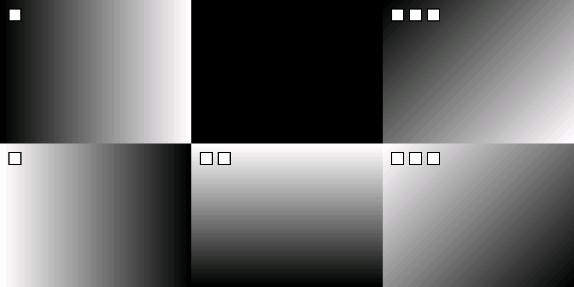

# M 板 J8 双目摄像头到 S 板六宫格测试指南

适用硬件已由用户确认：RK3568_MES2L100H 底板 J8 的 40 针 FPGA GPIO，直接连接小眼睛 DOUBLE-DVP-OV5640 双目模块。FPGA 为 PG2L100H-6IFBG484。本次只验证摄像头视频采集和显示，不运行自动驾驶控制。

本次提供独立的 `fpga/fpga_pcie_ov5640/stereo_j8` 配置。原三路摄像头 PDS 工程保持原样。新配置需要在 PDS 中综合、布局布线并生成新的位流；仓库旧 `project/generate_bitstream/image_pcie_capture.sbit` **不是**本次测试位流。

已完成软件测试和两项 RTL 单元仿真；尚未在 PDS 中完成整机综合、时序收敛、下载或板上实拍验证。下面是可执行的上板方案，不能把这些本机检查当作硬件验收。

## 1 测试画面和数据路径

S 板显示窗口固定 960×480，每格 320×240：

| 上排 M 左前方 | 上排 M 正前方 | 上排 M 右前方 |
| --- | --- | --- |
| 双目 CAM1 实拍 | 黑色占位 | 双目 CAM2 实拍 |
| 下排 S 第一路灰度占位 | 下排 S 第二路灰度占位 | 下排 S 第三路灰度占位 |

CAM1/CAM2 是摄像头模块原理图的电气编号，不保证等于面对镜头观察时的左右。启动后遮挡其中一颗镜头确认；如反了，用 `--swap-eyes` 交换左右画面，无需修改 FDC。

```text
双目模块 CAM1 ─ J8 ─ cmos5 ─ SCCB配置/DVP采集 ┐
                                            ├ M FPGA DDR3 → PCIe → M RK3568
双目模块 CAM2 ─ J8 ─ cmos6 ─ SCCB配置/DVP采集 ┘                  │
                                                               UDP
                                                                ↓
                                                     S RK3568 → X11 → HDMI显示器
```

UDP 由 M 板 **RK3568 Linux 网口**发送，不是 FPGA 自己的 RGMII 网口。S 板本次用软件生成三路灰度图，因此无需给 S FPGA 更换位流或接摄像头。

PCIe/UDP 保留每板 640×480 RGB565 的四格载荷。本测试位流将左上格写 CAM1、右上格写黑、左下格写 CAM2，右下格为不上屏的保留格。S 渲染器取前三格并排为一行。摄像头分别采 640×480，FPGA 隔行隔列取样为 320×240。

下图由本机真实 UDP 重组与六格合成代码产生。两颗实拍摄像头的位置暂用渐变表示，只说明布局，不是板上实拍证据：



四个空位是本次明确配置的占位，不是自动检测摄像头插拔的结果。现有实现没有热插拔后的失帧超时覆盖；某个实际摄像头中途停止，可能保留旧帧。

## 2 手册依据和连接方向

仓库资料位置：

- `fpga/fpga_pcie_ov5640/doc/doc/RK3568_MES2L50H_100H_硬件使用手册_v1.1.pdf`：PDF 第24、25页，印刷页21、22，§2.1.13，表3-12，40针扩展口。
- `fpga/fpga_pcie_ov5640/doc/doc/DOUBLE-DVP-OV5640-1113(2).pdf`：唯一一页，左侧 J17 和两颗摄像头的电路。
- 同一本板卡手册：PDF 第17页/印刷页14为 FPGA JTAG；PDF 第18、19页为按键/LED；第9、11页为25 MHz和100 MHz时钟；第12、13页为DDR3；第26页为RK与FPGA的板内互联。

**手册正文称40针口为 J8，其图3-12上的连接器标成 J10。** 本指南按用户确认的底板 J8，以及表3-12的针号/网络/球位使用；不要拿 ARM GPIO 或 FMC 转接板的相似40针口替代。

原页截图保留在本指南旁，便于逐项对照：

- [底板40针口原页与1至22针](stereo_j8/board-24.png)
- [底板23至40针原页](stereo_j8/board-25.png)
- [双目模块完整原理图](stereo_j8/camera-1.png)
- [FPGA JTAG 原页](stereo_j8/board-17.png)

连接时 M 板断电。把双目模块 J17 的1脚对准底板 J8 的1脚，所有针号一一对应；以 PCB 的1脚标识、方焊盘和原理图为准，不按排针朝向猜。不要错开一排或反插。J8.2 是5 V；这张摄像头原理图的 J17.2 未连接，不能把它改接到摄像头 IO。

模块 J17.39、40 接3.3 V，J17.1、37、38接地；J17.2、15、16、19、28、30、36未接摄像头信号。模块内部 RT9011 产生1.5 V/2.8 V；U27提供24 MHz XCLK；PWDN通过R5/R6下拉。因此 **不需要从 FPGA 添加 XCLK 或 PWDN 顶层引脚**。

所有 DVP 数据/同步信号方向是摄像头→FPGA；RESET 是FPGA→摄像头；SDA双向。新的 SCCB SCL 使用开漏输出，释放高电平由模块上的2.8 V上拉提供。GPIO Bank 按板卡设计和原工程使用 LVCMOS33，不能因模块内部2.8 V就随意修改板上供电；不支持5 V逻辑输入。

## 3 双目摄像头全部28根信号的约束表

表中“针号”同时是底板 J8 和摄像头 J17 的针号；“FPGA球位”才是 PDS 的 Pin Location。原理图的 `REST` 即摄像头复位信号，这里使用代码端口名 `reset`。

| 信号 | CAM1针号 | CAM1 FPGA球位 | PDS端口 | CAM2针号 | CAM2 FPGA球位 | PDS端口 |
| --- | ---: | --- | --- | ---: | --- | --- |
| SDA | 4 | P14 | cmos5_sda | 20 | N17 | cmos6_sda |
| SCL | 6 | R14 | cmos5_scl | 23 | U20 | cmos6_scl |
| RESET | 12 | V18 | cmos5_reset | 35 | AA21 | cmos6_reset |
| VSYNC | 17 | W17 | cmos5_vsync | 34 | R17 | cmos6_vsync |
| HREF | 9 | N15 | cmos5_href | 33 | U18 | cmos6_href |
| PCLK | 18 | T18 | cmos5_pclk | 32 | P16 | cmos6_pclk |
| D0 | 8 | Y18 | cmos5_data[0] | 31 | U17 | cmos6_data[0] |
| D1 | 11 | AA19 | cmos5_data[1] | 25 | V20 | cmos6_data[1] |
| D2 | 13 | AB20 | cmos5_data[2] | 26 | R16 | cmos6_data[2] |
| D3 | 14 | V19 | cmos5_data[3] | 24 | P15 | cmos6_data[3] |
| D4 | 7 | L13 | cmos5_data[4] | 27 | W19 | cmos6_data[4] |
| D5 | 5 | AB22 | cmos5_data[5] | 29 | W20 | cmos6_data[5] |
| D6 | 10 | Y19 | cmos5_data[6] | 22 | P17 | cmos6_data[6] |
| D7 | 3 | AB21 | cmos5_data[7] | 21 | AB18 | cmos6_data[7] |

例如 CAM1_D0 在模块原理图接 J17.8，底板手册 J8.8 对应 Y18，所以约束为 `cmos5_data[0] → Y18`。两张表依次拼接得出所有28条映射。板卡表中的 `Ab20` 按标准球位记法写作 `AB20`。

可用文件：

- **导入工程用：** `fpga/fpga_pcie_ov5640/stereo_j8/stereo_j8.fdc`，完整包含摄像头、DDR、时钟、复位和PCIe相关约束。
- **核对摄像头用：** 同目录 `camera_pins_only.fdc`，仅28根摄像头信号；已包含在完整FDC内，**不要同时导入两个文件**。

FDC语法举例：

```tcl
define_attribute {p:cmos5_data[0]} {PAP_IO_DIRECTION} {INPUT}
define_attribute {p:cmos5_data[0]} {PAP_IO_LOC} {Y18}
define_attribute {p:cmos5_data[0]} {PAP_IO_VCCIO} {3.3}
define_attribute {p:cmos5_data[0]} {PAP_IO_STANDARD} {LVCMOS33}
```

本次其余必要板内接口如下，均不需要外接飞线：

| FPGA端口或功能 | 球位/来源 | 用途 |
| --- | --- | --- |
| free_clk | V4，手册25 MHz晶振 | DDR、摄像头配置PLL等参考时钟；不是50 MHz |
| board_rst_n | M15，KEY0/SW7 | 用户逻辑复位，低有效，LVCMOS18 |
| perst_n | M16，KEY1/SW8 | 沿原工程作为PCIe逻辑复位；这是按键，不等同于ARM专用PERST线 |
| ref_clk_p/n | F6/E6，板载100 MHz | PCIe HSST参考时钟 |
| DDR3 | 手册第12、13页，完整FDC的mem_* | 使用已配置的16位DDR3 IP；不要重新自动分配引脚 |
| PCIe rxp/rxn/txp/txn | 原PCIe IP的HSST lane0/1及其固定位置约束 | 已在PCB内连接RK3568，不在J8上；不能设成普通LVCMOS GPIO |
| heart_beat_led | J16，LED3 | DDR初始化后心跳 |
| pclk_led | M17，LED4 | PCIe用户时钟指示，不能据此判断摄像头已出图 |

新FDC将按键和LED的Bank电压标注统一为1.8 V，与手册相应原理图的`1V8`信号一致；原文件部分位置写成3.3 V。DDR/PCIe内部位置约束沿用原工程，不是由J8表推导的。相机PCLK的56 MHz约束暂沿原工程，实际频率与DVP输入时序裕量需要用PDS报告和上板测量确认，不能据此宣称时序已经收敛。

## 4 在 PDS 新建测试工程

本机原工程和IP由 PDS 2022.2-SP6.4 生成。优先使用兼容该工程的完整 PDS 安装及有效许可证。若使用别的版本，保留原IP副本后检查迁移结果，不要直接用新IP默认参数替换DDR/PCIe。软件来源：[紫光同创PDS下载页](https://www.pangomicro.com/resources/software/pds/)。

### 4.1 文件准备

1. 在电脑保留整个更新后的仓库，尤其是 `source`、`project/ipcore`、`stereo_j8` 三个相邻目录。不要只复制新顶层和FDC。
2. 路径建议使用英文和数字，例如当前 `D:/vmshare/image_recognition`。打开新目录 `fpga/fpga_pcie_ov5640/stereo_j8`，应看到5个测试HDL、FDC、Tcl和源文件清单。
3. 已生成文件可以直接使用，不要求电脑装Python。若之后从原工程重新生成，仓库根目录执行：

```powershell
python scripts/prepare_stereo_j8.py
python scripts/check_stereo_j8.py
```

生成器只更新独立测试目录。手工修改生成的顶层、AXI控制器或FDC后再次运行生成器会覆盖这些修改；持续修改应同步更新生成器。`stereo_camera_top.v` 是手工维护的文件，不会被生成器覆盖。

### 4.2 新建工程和器件选择

1. 启动 PDS，选择 `File → New Project`（部分版本显示 New Project 向导）。
2. 工程名填 `stereo_j8_test`。工程工作目录选一个**新的空目录**，例如 `D:/pds_work/stereo_j8_test`，不要覆盖原来的 `project/project.pds`。
3. 如果向导有“创建同名子目录”，确认最终路径，避免重复两层同名目录。
4. 工程类型选择RTL/HDL设计；语言为Verilog。
5. 器件选择：Family=`Logos2`，Device=`PG2L100H`，Package=`FBG484`，Speed Grade=`-6`。不要选PG2L50H或FBG676。若界面另有温度等级，按芯片丝印的I工业级填写。
6. 源文件与约束步骤可以先空着，完成向导并保存工程。下一节一次性导入，避免手工遗漏依赖。

界面菜单名称随版本略有差异，以下Tcl命令使用仓库原PDS流程中实际使用的 `set_arch / add_design / add_constraint / compile`，比逐个窗口寻找选项更容易核验。

### 4.3 添加29个HDL和5个IP

在PDS的Tcl Console中执行下列一行，路径使用 `/`：

```tcl
source {D:/vmshare/image_recognition/fpga/fpga_pcie_ov5640/stereo_j8/add_sources.tcl}
```

此脚本设置器件、导入29个HDL文件、5个IP描述文件和1个完整FDC。它不下载板卡、不改Flash，也不运行漫长的综合。**在空工程中执行一次**；重新导入前先检查是否已有这些源，避免重复。

若想全部手动添加，双击或右击 Sources 中的 `Designs`，使用 Add Design/Add Files 类入口，严格按同目录 `design_files.txt` 的每一行添加。路径相对于 `stereo_j8` 目录，完整清单由脚本维护；主要组成如下：

| 类别 | 必须添加的文件 |
| --- | --- |
| 新测试RTL，共5个 | `image_pcie_capture.v`、`stereo_camera_top.v`、`stereo_axi_ctrl.v`、`stereo_reg_config.v`、`stereo_i2c_com.v` |
| DVP字节采集，共1个 | `../source/ov5640/rtl/cmos_capture_data.v` |
| PCIe DMA和FIFO辅助RTL，共23个 | `design_files.txt` 中所有 `../source/pcie/...` 行，逐项添加，不用另一份 example_design 替换 |
| DDR IP | `../project/ipcore/ddr3/ddr3.idf` |
| 摄像头配置时钟PLL | `../project/ipcore/clk_1080p_gen/clk_1080p_gen.idf` |
| PCIe硬核封装 | `../project/ipcore/pcie_test/pcie_test.idf` |
| 摄像头写FIFO | `../project/ipcore/W_FIFO_16i_128o/W_FIFO_16i_128o.idf` |
| PCIe读FIFO | `../project/ipcore/R_FIFO_128i_128o/R_FIFO_128i_128o.idf` |

导入`.idf`时保留其同目录和子目录中的RTL/加密`.vp`等文件，PDS会按描述加载依赖。不要将`.idf`及它管理的所有`.v`再各导入一次。也不要递归全选仓库所有Verilog：原顶层与测试顶层同名，仿真文件还包含假的FIFO模块，会造成重复定义或错误实现。

**禁止加入综合工程：** 原 `../source/image_pcie_capture.v`、原 `ov5640_top.v`、CNN、UART屏、FSPI控制、旧 `impl.tcl`、`test_stereo_axi.sv`、`test_stereo_config.sv`、IP的仿真testbench或旧的综合输出网表。旧 `impl.tcl` 带有另一台电脑的绝对路径和PG2L50H历史配置，不能直接运行。

### 4.4 指定顶层和核对引脚

1. 顶层选择 `image_pcie_capture`，必须来自 `stereo_j8/image_pcie_capture.v`。
2. 添加完整 `stereo_j8.fdc` 到 Constraints（Tcl导入已完成这一步，别再重复添加）。
3. 执行 Compile/RTL Compile，或在Tcl输入：

```tcl
compile -top_module image_pcie_capture
```

4. 在编译后的约束编辑器/SCOPE的IO或Pin界面，筛选 `cmos5`、`cmos6`。对照本指南28根信号表，检查Location、Direction、I/O Standard。输入 `data[0]` 对应D0，不能把数组顺序反过来。
5. 确认没有 `cmos2`、`RXD`、`spi_*` 外部端口；两个PCLK分别为T18/P16，两个RESET为V18/AA21；相机IO为LVCMOS33。
6. 核对DDR与PCIe约束全部加载，检查无重复球位或未约束普通IO。PCIe串行引脚由专用HSST位置决定；不应给它们手工分配普通GPIO。
7. 如果手动修改引脚，在该约束窗口保存/导出到测试FDC，再重新编译。PDS的引脚设置决定FPGA内部逻辑接哪个封装球，**不会改变PCB连线**。

### 4.5 综合到位流

按PDS流程依次执行：Compile → Synthesize → Device Map → Place & Route → Report Timing → Generate Bitstream。可逐项双击流程树；对应原工程使用的命令为：

```tcl
synthesize -ads -selected_syn_tool_opt 2
dev_map
pnr
report_timing
gen_bit_stream
```

每步成功后再继续。重点检查：无找不到模块/IP、重复定义、多驱动、Bank电压冲突、未约束普通IO；DDR/PCIe IP位置有效；查看setup/hold和未约束路径。不能把“生成了文件”当成时序通过。相机输入delay/skew和跨时钟路径仍需要结合实物与报告评审，测试配置没有宣称量产级时序闭合。

在**新工程**输出目录查找 `generate_bitstream/image_pcie_capture.sbit`，以PDS实际结果路径为准，核对生成时间。不要误选仓库原工程中早已存在的同名位流。可以把本次产物单独复制并命名为 `stereo_j8_test.sbit` 方便区分。

## 5 下载到 M 板 FPGA

### 5.1 先用 JTAG 临时加载

1. 停止M板上的摄像头/PCIe读取程序；首次装接摄像头和JTAG排线时板卡断电。本次只接摄像头与显示链路，车轮驱动电源保持断开。
2. 使用兼容紫光同创的USB-JTAG下载器连接PC和底板 **FPGA JTAG J12，2×5针**。不是ARM的20针JTAG，也不是RK3568调试串口USB。
3. 按手册核对J12：1=TCK、3=TDO、5=TMS、9=TDI，4=A3V3参考，2/10=GND，其余按原图保留。对准1脚。下载器的参考电压连接不等于让下载器给整板供电。
4. 给开发板接正常电源，确认PC识别下载器；未识别时安装该下载器配套驱动。
5. PDS打开 `Tools → Configuration` 或流程入口 `Configuration`，在设备区域执行 `Scan Device`。应检测到 `PG2L100H`。
6. 为扫描出的FPGA选择刚生成的 `stereo_j8_test.sbit`，选择FPGA配置/Program操作，再执行界面的运行按钮。等待完成/成功状态。不同PDS补丁的按钮名可能为Program/Run，以“配置FPGA SRAM”为目标，不选择擦除Flash。
7. 完成后观察LED3的DDR初始化心跳。没有心跳先查时钟/复位/DDR，摄像头和UDP软件无法修复DDR初始化失败。

`.sbit`经JTAG配置到FPGA的易失配置存储器，断电后会丢失。若板上Flash仍有旧程序，下次上电会重新加载旧程序。测试阶段记录本次下载的文件和时间。

### 5.2 让 RK3568 识别重新配置后的 PCIe

先在M板Linux终端查看：

```bash
lspci -nn
ls -l /dev/pango_pci_driver
dmesg | tail -60
```

JTAG下载时PCIe端点会消失又出现，Linux不一定自动重新枚举。尚未加载采集驱动、没有程序占用时，可先扫描：

```bash
echo 1 | sudo tee /sys/bus/pci/rescan
lspci -nn
```

若仍不存在端点，优先按板卡原厂PCIe启动流程让RK在FPGA配置完成后启动/重新枚举。不要盲目对所有PCI设备执行remove，也不要将不存在端点时创建的设备文件当作链路正常。

普通Linux重启能否保留本次FPGA配置，取决于板卡启动程序是否重置/重配FPGA；**不能保证重启后仍是本次SRAM位流**。如果每次重启又回到旧逻辑，需要下一节的Flash固化或板卡支持的FPGA先配置、RK后启动流程。

### 5.3 验证后再固化 Flash

板卡手册§2.1.5给出FPGA配置Flash型号 `XT25BF128FSSIGU-W`、容量128 Mbit，并说明RK可通过模拟开关访问该Flash。固化会替换现有上电程序，应先保留当前可用位流或执行工具支持的Readback备份。

1. 在PDS Configuration中保持FPGA JTAG连接，使用SPI Flash配置入口；选择实际芯片型号或厂商明确认可的兼容型号，不能仅凭容量相同选择。
2. 由本次生成的`.sbit`制作工具要求的Flash配置文件，通常为`.sfc`；使用PDS的转换/Flash配置功能，不是把文件扩展名改成`.sfc`。
3. 按工具的Flash流程执行擦除、编程和校验。若列表中找不到XT25BF128或工具提示不兼容，停在型号选择，查此PDS版本的Flash支持列表/模块厂商说明，不猜测替代芯片。
4. 等待Verify成功后再断电重启；重新检查DDR心跳、PCIe枚举、实拍画面。这样才能确认“上电自动加载新测试位流”。

本次交付的是源代码和约束，没有在此电脑生成`.sbit/.sfc`，也没有访问或改写板卡Flash。Flash窗口的具体型号列表须以你们安装的PDS版本为准。

## 6 在两块 RK3568 上运行测试

把本次更新的源码同步到两块板卡对应仓库。以下命令均在各自仓库根目录执行。PC上的Windows可执行文件不能复制到RK3568运行。

### 6.1 S 板先启动接收和显示

显示器接S板RK的HDMI并进入Linux桌面，建议在桌面终端运行：

```bash
sudo bash scripts/stop_all.sh
make -C planning bin
sudo bash scripts/start_s.sh --local-stub
tail -f planning.log
```

`--local-stub`提供下排三路灰度占位，并关闭行人模型及彩色叠加。S板启动后、M还没发送时，上排黑色是正常的。窗口标题应含 `6CH: M top / S bottom`。

S的完整显示程序链接X11与仓库RKNN运行时。若缺开发库，根据板卡Linux发行版安装对应X11开发包并确认`lib/librknnrt.so`为RK3568版本；不要用Windows库或强行绕过链接错误。

### 6.2 M 板启动双目实时采集

确认M已加载新FPGA配置、摄像头上电，使用两板原来已验证的RK网口连线：

```bash
sudo bash scripts/stop_all.sh
make -C planning sender
sudo bash scripts/start_m.sh --stereo-pcie
tail -f udp_send.log
```

`make -C planning sender`是新增的M端单独构建目标，不需要X11/RKNN库；原 `make -C planning bin`也会构建它。**这次不要用 `--stub`，也不要用 `--real`。** 前者全是模拟图，后者仍走原有模型感知链路。

日志应含：

```text
STEREO-J8-v1
direct PCIe -> UDP, no NPU; M=[CAM1, EMPTY, CAM2]
```

脚本加载仓库 `drivers/pango_pci_driver.ko`，配置网络，启动独占PCIe的发送器。若内核提示`invalid module format`，说明ko与当前板卡内核不匹配，需要用该板系统配套驱动/内核源码构建；不能用改文件名解决。若`/dev/pango_pci_driver`不存在，先看PCIe枚举和驱动日志。

默认M为 `192.168.100.10/24`，S为 `192.168.100.20/24`，UDP端口8888。M可用 `ping 192.168.100.20` 检查连通。脚本会配置所选网口，最好使用本地终端，避免把当前SSH管理链路改掉。

M发送速率上限暂设5帧/秒，实际帧率还受PCIe采集耗时影响。这是首次视频通路测试，不代表论文帧率。

如果左右相反：

```bash
sudo bash scripts/stop_all.sh
sudo bash scripts/start_m.sh --stereo-pcie --swap-eyes
```

启动脚本会检查已有发送器及常见采集进程，但仍需自己停止旧工程中其他名字的PCIe读取程序；该驱动不能同时让两个程序读取同一图像流。

### 6.3 验收顺序

1. 查看S的下排三路灰度正常，确认显示路径可用。
2. M日志“已发帧”持续增加；S日志 `frames_recv`持续增加。驱动成功/发送计数增加都不证明摄像头有图，要继续下面的遮挡验证。
3. 遮挡CAM1，上排左格随之变化；遮挡CAM2，上排右格变化。交换配置后按新位置判断。
4. 上排中格始终黑色，下排三格保持灰度；无第四列、棋盘格、模型识别图标。
5. 移动相机前的物体，确认两格随时间更新，没有只显示同一张缓存图。
6. 连续运行数分钟，检查花屏、错行、重复行、明显卡顿和内核DMA错误。发现问题先按下一节定位，不急着接入车辆控制。

## 7 常见故障和逐级定位

| 现象 | 首先检查 |
| --- | --- |
| PDS Scan Device 无器件 | FPGA J12而非ARM JTAG；下载器驱动、供电、1脚方向 |
| Compile缺模块或重复定义 | 仅按design_files.txt导入；5个idf子目录齐全；没混入原顶层和test_*.sv |
| PDS报Bank电压冲突 | 本测试完整FDC是否唯一导入；M15/M16、J16/M17为1.8 V，摄像头为3.3 V |
| DDR心跳没有 | free_clk=V4/25 MHz、KEY0释放、DDR IP与原板16位参数、DDR引脚/时序 |
| Linux没有PCIe端点 | 先配置FPGA再枚举；KEY1是否一直按下；PCIe复位/时钟/HSST IP |
| ioctl失败或发送器退出 | 检查ko与内核、设备权限、端点链路；没有自动回退到模拟图 |
| 左右都黑但有UDP帧 | 确认不是旧位流；J8方向/3.3 V；SCCB ACK；摄像头复位和PCLK/HREF/VSYNC |
| 只有一颗有图 | 对应SDA/SCL/RESET/data映射；观察该颗reg_index是否在重试；镜头排线 |
| 图像分界错位或斜纹 | 使用本次新位流；PCIe仍为每行760像素、剥离120；检查D0至D7顺序、RGB565高低字节、PCLK采样时序 |
| 图像能显示但停住 | 遮挡确认是否更新；摄像头失帧时旧画面不会自动超时变黑；检查对应PCLK/VSYNC和DDR读写 |
| 没显示窗口但有收包 | DISPLAY/XAUTHORITY/桌面用户；从S的桌面终端启动，看planning.log |
| 又出现2×4 | 旧进程或旧二进制；停止所有旧显示器，重建并检查版本标识和实际路径 |

需要PDS在线逻辑分析时，优先观察 `u_ov5640_top/locked`、`cmos5_reset/cmos6_reset`、`u_ov5640_top/cfg5/reg_index`、`cfg6/reg_index`、两路`init5/init6`、`video5_de/video6_de`、对应VSYNC、`ddr_init_done`和AXI帧计数。PCLK域和配置时钟域的信号分别选相应采样时钟，不能用慢时钟下的几个样点判断整个DVP时序。

新的SCCB逻辑遇到NACK会重试当前寄存器，不会把未接的摄像头标为初始化完成。寄存器表写完后，采集模块还会等约11次VSYNC才开放像素输出；首次下载后留出数秒，不要立即把黑屏认定为失败。

## 8 本次代码改动与验证范围

| 改动 | 目的 |
| --- | --- |
| 独立stereo_j8顶层、摄像头配置与FDC | 用J8的cmos5/6直采，两路实拍和一格黑；不依赖cmos2/CNN/HMI；既有低有效运动引脚固定为高 |
| 独立stereo_axi_ctrl | 左右摄像头分别选DDR读帧银行，读帧边界锁存；不再被缺失第三颗摄像头计数卡住；启动未就绪图块填黑 |
| 关闭原623像素补偿 | 本测试使用原始DVP数据，不沿用CNN路径的经验性整图移位；仍须板上验证对齐 |
| stereo_camera_top | PLL锁定/复位后的上电等待、两颗摄像头独立SCCB、开漏SCL、RGB565采集 |
| stereo_reg_config和stereo_i2c_com | 分频时钟停住时也能复位；遵守上电等待；检查四次ACK，NACK重试 |
| udp_m_send_main --stereo-pcie | PCIe直接采图与发送，独立于NPU/shm_lane；车道结果为UNKNOWN和0置信度 |
| stereo_test_frame | 清空固定空位，支持--swap-eyes，不动有效图块尺寸 |
| start_m.sh与resolve_bin.sh | 新入口不启动感知进程；必须匹配STEREO-J8-v1；启动失败明确报错，防常见并发采集 |
| planning sender目标 | M端单独构建发送器，无需X11/RKNN链接 |
| pcie_capture | 增加DMA行长参数校验；启动映射后触发失败会释放映射 |
| 两个RTL测试、C测试、引脚校验脚本 | 检查缺路、独立读银行、地址、ACK重试、占位、交换、UDP重组和引脚清单 |

验证结果：

- C侧planning决策、UDP重组、六格合成测试通过；新增黑色中格、左右交换和UDP模拟输出检查通过。
- 新M发送器源文件以`-Wall -Wextra -Werror`编译通过；启动脚本隔离回归通过。
- 使用本机现有Vivado XSim只做普通RTL单元仿真，`test_stereo_axi`与`test_stereo_config`通过；不使用Vivado给Pango FPGA综合或下载。FIFO在这项单元仿真中是简化接口模型，不验证真实DDR/PCIe IP。
- 28条摄像头球位与独立抄录的手册映射一致；完整FDC的89个显式球位无重复；5个IP的128条源路径均存在。
- 86个公开Verilog文件经解析/连接检查，余下未解析单元属于Pango加密IP或器件原语，必须在PDS中完成真正综合。

未完成：PDS整机实现与时序验收、RK3568 Linux实际链接/运行、摄像头电气/图像质量、板上DMA/UDP测试。独立读银行也不等于双目硬件同步或无撕裂保证；两个视角的同步曝光、立体标定和深度计算均不属于此次测试。

当前更新为工作区改动，未替你们提交、推送或刷板。
